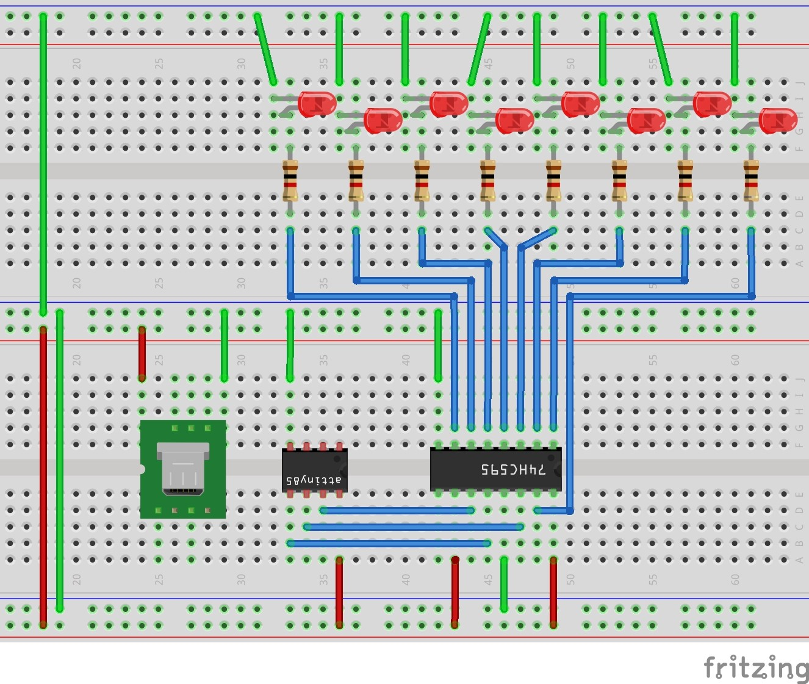
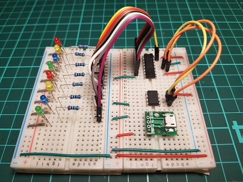

# ATtiny85 led chaser

Simple Arduino 8x led chaser using a ATtiny85 and the 74H595 serial to parallel register.

Sequences include:
* sweep
* sweep_and_stack
* sweep_bi_direction
* one_in_two
* one_in_three
* binary_count
* blink_all

I use the micro USB just for power, an easy way to connect 5v to my projects.  

<i>Circuit layout in Fritzing</i>

<i>The actual circuit</i>
